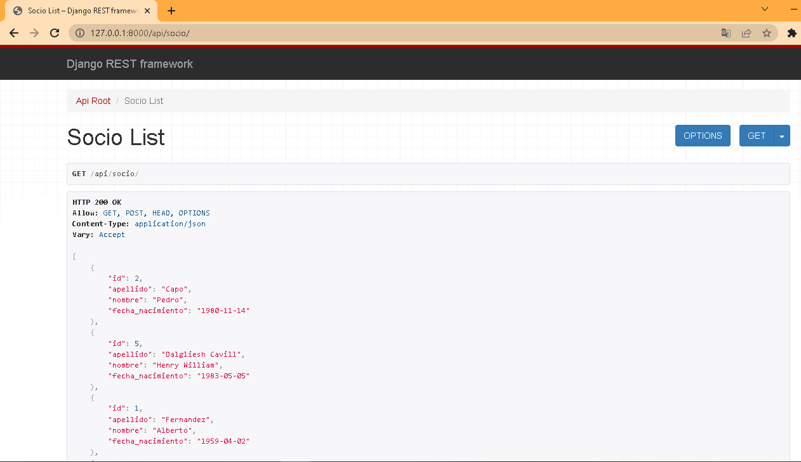
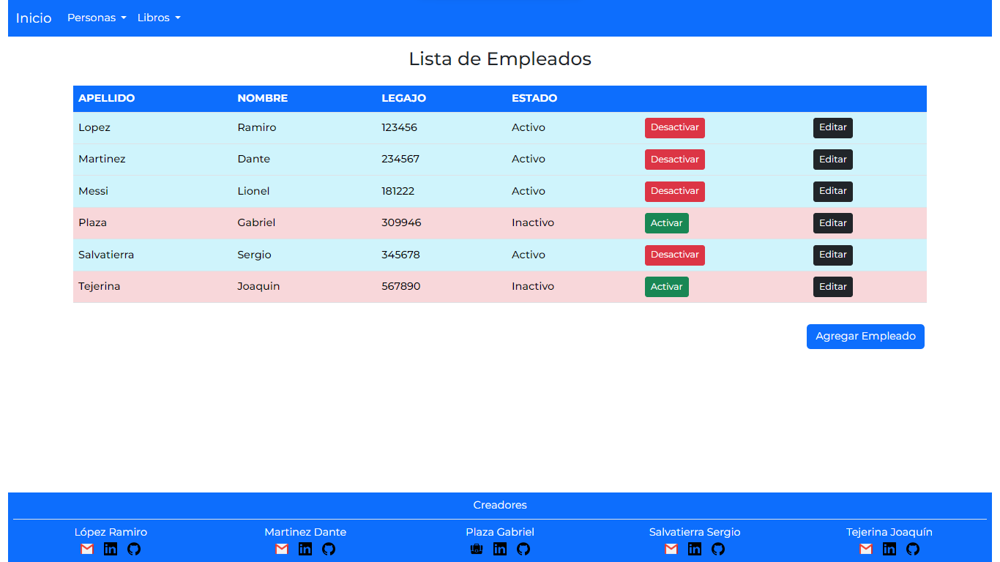
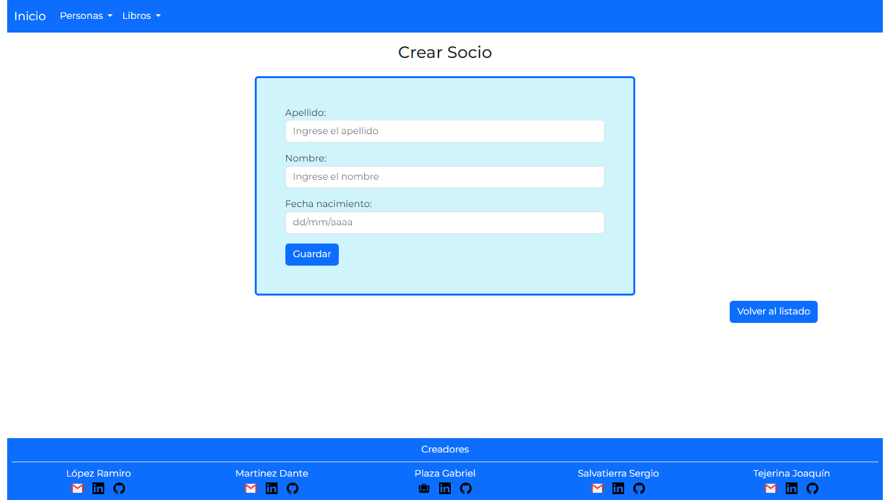

# ProyectoBiblioteca

Python - Django
Comisión 1. Squad 2. Bootcamp Alkemy

## Descripcion

La aplicación web esta diseñada usando Python y Django para dar
funcionalidades a una biblioteca, la cual permitirá al usuario agregar o quitar libros con sus correspondientes autores, consultar el
listado de libros y autores, agregar o quitar socios a los cuales se les prestaria dichos libros, agregar o quitar, los préstamos realizados consutarlos en una lista y agregar o quitar empleados que trabajen en la Libreria incluyendo un listado de los mismos. Cuenta con endpoint con devoluciones de datos en JSON

## Modulos

Api

**Descripcion**
 
(App encargada de los endpoints de las otras apps envio de de informacion en formato JSON)

**Contenido**
- **views.py** ( Funciones de envio de Datos en Formato JSON )
    - detalle_libro (Devuelve el Registro De un Libro en Fomato JSON mostrando los campos: "Id, titulo, descripcion y autor", en caso de no encontrarlo devuelve una lista vacia )
    - listar_empleados (Devuelve el listado completo de empleados mostrando sus campos: "Id, nombre, apellido y numero de legajo" en formato JSON)
    - listar_libros (Devuelve el listado completo de libros mostrando sus campos: "Id, titulo y autor" en formato JSON)
    - listar_socios (Devuelve el listado completo de socios mostrando sus campos: "Id, nombre, apellido y fecha de nacimiento" en formato JSON)
- **urls.py** (Direcciones del Navegador)
    - path /libros/<int:id>/ ( Recibe la Id o Pk de un libro y hace uso de funcion  detalle_libro para mostrar los datos del libro en formato JSON )
    - path /empleados/ ( Hace uso de funcion  listar_empleados para mostrar una lista con los datos de los empleados en formato JSON )
    - path /libros/ ( Hace uso de funcion  listar_libros para mostrar una lista con los datos de los libros en formato JSON )
    - path /socios/ ( Hace uso de funcion  listar_socios para mostrar una lista con los datos de los socios en formato JSON )

Autor

**Descripcion**
 
(App encargada de la alta, baja, modificacion, listado y redireccionado a sus correspondientes Templates de los Autores)

**Contenido**
- **admin.py** ( Administrador)
    - Agregado modelo al administrador utilizando list_display ( campos: nombre, apellido, nacionalidad y activo )
    - list_filter ( campos: activo y nacionalidad )
    - search_field ( campos: nombre y apellido )
- **models.py** ( Ubicacion Principal del modelo autor )
    - nombre ( Nombre del Autor )
    - apellido ( Apellido del Autor)
    - nacionalidad ( Nacionalidad del Autor)
    - activo ( Por default se crea en True)
- **views.py** ( Funcionalidades CRUD, activar o desactivar autor )
    - CrearAutor ( Utiliza su formulario ***forms.py*** para crear un Autor / uso Generic Views)
    - ListarAutores ( Funcion que utiliza un template para mostrar la lista / uso Generic Views )
    - EditarAutor ( Utiliza su formulario ***forms.py*** para editar un Autor / uso Generic Views )
    - activar_autor ( funcion que cambia Activo a True)
    - desactivar_autor ( funcion que cambia Activo a False)
- **urls.py** (Direcciones del Navegador)
    - path /nuevo/ (Uso de clase CrearAutor y el template crear.html en la ruta "templates/autores/" para la creacion de un nuevo autor)    
    - path /listar/ (Uso de clase ListarAutores y el template listar.html en la ruta "templates/autores/" para mostrar la lista de Autores creados)
    - path /modificar/<int:id>/ (Recibe la Id o Pk de un autor y hace uso de clase EditarAutor y el template editar.html en la ruta "templates/autores/" para modificarlo)
    - path /activar/<int:id>/ (Recibe la Id o Pk de un Autor y hace uso de funcion activar_autor para cambiar el campo Activo a True)
    - path /desactivar/<int:id>/ (Recibe la Id o Pk de un Autor y hace uso de funcion desactivar_autor para cambiar el campo Activo a False)

Biblioteca

**Descripcion**
 
(App encargada de la alta, baja, modificacion, listado y redireccionado a sus correspondientes Templates de los Prestamos de Libros a sus Socios )
 
**Contenido**
- **admin.py** ( Administrador)
    - Agregado modelo al administrador utilizando list_display ( campos: fecha_prestamos, fecha_devolucion, socio, empleado y libro )
    - ordering ( fecha_devolucion )
    - search_field ( campos: socio, empleado y libro )
- **models.py** ( Ubicacion Principal del modelo PrestamoLibro )
    - fecha_prestamos ( La fecha en la que se realizo el prestamo del libro )
    - fecha_devolucion ( Fecha en la que se devuelve el Libro)
    - socio ( La persona a la que se le presta el Libro / ForeignKey de modelo socio )
    - empleado ( La persona encargada del prestamo del libro / ForeignKey de modelo empleado)
    - libro ( Datos del libro Prestado / ForeignKey de modelo libro )
- **views.py** ( Funcionalidades CRUD y desactivar prestamo )
    - CrearPrestamoLibro ( Utiliza su formulario ***forms.py*** para crear un Prestamo / uso Generic Views)
    - ListarPrestamoLibro ( Funcion que utiliza un template para mostrar la lista / uso Generic Views )
    - EditarPrestamoLibro ( Utiliza su formulario ***forms.py*** para editar un Prestamo / uso Generic Views )
    - desactivar_prestamo ( funcion que cambia Activo a False)
- **urls.py** (Direcciones del Navegador)
    - path /nuevo/ (Uso de clase CrearPrestamoLibro y el template crear.html en la ruta "templates/biblioteca/" para la creacion de un nuevo prestamo)    
    - path /listar/ (Uso de clase ListarPrestamoLibro y el template listar.html en la ruta "templates/biblioteca/" para mostrar la lista de prestamos creados)
    - path /modificar/<int:id>/ (Recibe la Id o Pk de un prestamo y hace uso de clase EditarPrestamoLibro y el template editar.html en la ruta "templates/biblioteca/" para modificarlo)
    - path /desactivar/<int:id>/ (Recibe la Id o Pk de un Prestamo y hace uso de funcion desactivar_prestamo para cambiar el campo Activo a False)

Empleado

**Descripcion**
 
(App encargada de la alta, baja, modificacion, listado y redireccionado a sus correspondientes Templates de los Empleados que trabajan en la Biblioteca )
 
**Contenido** 
- **admin.py** ( Administrador)
    - Agregado modelo al administrador utilizando list_display ( campos: apellido, nombre, numero_legajo y activo )
    - list_filter ( campos: activo )
    - search_field ( campos: nombre y apellido )
- **models.py** ( Ubicacion Principal del modelo empleado )
    - nombre ( Nombre del Empleado )
    - apellido ( Apellido del Empleado )
    - numero_legajo ( Numero de legajo del empleado )
    - activo ( Por default se crea en True)
- **views.py** ( Funcionalidades CRUD, activar o desactivar empleado )
    - CrearEmpleado ( Utiliza su formulario ***forms.py*** para crear un Empleado / uso Generic Views)
    - ListarEmpleados ( Funcion que utiliza un template para mostrar la lista / uso Generic Views )
    - EditarEmpleado ( Utiliza su formulario ***forms.py*** para editar un Empleado / uso Generic Views )
    - activar_empleado ( funcion que cambia Activo a True )
    - desactivar_empleado ( funcion que cambia Activo a False )
- **urls.py** (Direcciones del Navegador)
    - path /nuevo/ (Uso de clase CrearEmpleado y el template crear.html en la ruta "templates/empleados/" para la creacion de un nuevo empleado)    
    - path /listar/ (Uso de clase ListarEmpleados y el template listar.html en la ruta "templates/empleados/" para mostrar la lista de Empleados creados)
    - path /modificar/<int:id>/ (Recibe la Id o Pk de un Empleado y hace uso de clase EditarEmpleado y el template editar.html en la ruta "templates/empleados/" para modificarlo)
    - path /activar/<int:id>/ (Recibe la Id o Pk de un Empleado y hace uso de funcion activar_empleado para cambiar el campo Activo a True)
    - path /desactivar/<int:id>/ (Recibe la Id o Pk de un Empleado y hace uso de funcion desactivar_empleado para cambiar el campo Activo a False)

Libro

**Descripcion**
 
(App encargada de la alta, baja, modificacion, listado y redireccionado a sus correspondientes Templates de los Libros que se encuentran en la Biblioteca )
 
**Contenido** 
- **admin.py** ( Administrador)
    - Agregado modelo al administrador utilizando list_display ( campos: titulo, descripcion, isbn, autor y activo )
    - list_filter ( campos: activo )
    - search_field ( campos: titulo )
- **models.py** ( Ubicacion Principal del modelo libro )
    - titulo ( Titulo del Libro )
    - descripcion ( Descripcion del Libro, puede tener o No )
    - isbn ( El isbn es un estandard número de 13 cifras que identifica a cada libro )
    - autor ( La persona que escribio el libro / ForeignKey de modelo autor)
    - activo ( El libro esta disponible o no. Por default se crea en True)
- **views.py** ( Funcionalidades CRUD, activar o desactivar empleado )
    - CrearLibro ( Utiliza su formulario ***forms.py*** para crear un Libro / uso Generic Views)
    - ListarLibros ( Funcion que utiliza un template para mostrar la lista / uso Generic Views )
    - EditarLibro ( Utiliza su formulario ***forms.py*** para editar un Libro / uso Generic Views )
    - activar_libro ( funcion que cambia Activo a True )
    - desactivar_libro ( funcion que cambia Activo a False )
- **urls.py** (Direcciones del Navegador)
    - path /nuevo/ (Uso de clase CrearLibro y el template crear.html en la ruta "templates/libros/" para la creacion de un nuevo libro )    
    - path /listar/ (Uso de clase ListarLibros y el template listar.html en la ruta "templates/libros/" para mostrar la lista de Libros creados)
    - path /modificar/<int:id>/ (Recibe la Id o Pk de un libro y hace uso de clase EditarLibro y el template editar.html en la ruta "templates/libros/" para modificarlo)
    - path /activar/<int:id>/ (Recibe la Id o Pk de un Libro y hace uso de funcion activar_libro para cambiar el campo Activo a True)
    - path /desactivar/<int:id>/ (Recibe la Id o Pk de un Libro y hace uso de funcion desactivar_libro para cambiar el campo Activo a False)

Socio

 
**Descripcion**
 
(App encargada de la alta, baja, modificacion, listado y redireccionado a sus correspondientes Templates de los Socios que quieran utilizar el servicio de retiro de los Libros que se encuentran en la Biblioteca )
 
**Contenido**
- **admin.py** ( Administrador)
    - Agregado modelo al administrador utilizando list_display ( campos: nombre, apellido, fecha_nacimiento y activo )
    - list_filter ( campos: activo )
    - search_field ( campos: nombre y apellido )
- **models.py** ( Ubicacion Principal del modelo socio )
    - nombre ( Nombre del Socio )
    - apellido ( Apellido del Socio )
    - fecha_nacimiento ( Fecha de Nacimiento del Socio )
    - activo ( Si es un socio dado de alta o no. Por default se crea en True)
- **views.py** ( Funcionalidades CRUD, activar o desactivar socio )
    - CrearSocio ( Utiliza su  - formulario ***forms.py*** para crear un Socio / uso Generic Views)
    - ListarSocio ( Funcion que utiliza un template para mostrar la lista / uso Generic Views )
    - EditarSocio ( Utiliza su formulario ***forms.py*** para editar un Socio / uso Generic Views )
    - activar_socio ( funcion que cambia Activo a True )
    - desactivar_socio ( funcion que cambia Activo a False )
- **urls.py** (Direcciones del Navegador)
    - path /nuevo/ (Uso de clase CrearSocio y el template crear.html en la ruta "templates/socios/" para la creacion de un nuevo libro )    
    - path /listar/ (Uso de clase ListarSocios y el template listar.html en la ruta "templates/socios/" para mostrar la lista de Libros creados)
    - path /modificar/<int:id>/ (Recibe la Id o Pk de un socio y hace uso de clase EditarSocio y el template editar.html en la ruta "templates/socios/" para modificarlo)
    - path /activar/<int:id>/ (Recibe la Id o Pk de un Socio y hace uso de funcion activar_libro para cambiar el campo Activo a True)
    - path /desactivar/<int:id>/ (Recibe la Id o Pk de un Socio y hace uso de funcion desactivar_libro para cambiar el campo Activo a False)

        

WebApp

 
**Descripcion**
 
(App principal del proyecto donde se encuentarn registradas las demas aplicacciones cuenta con un View para el renderizado del Home y el redireccionamiento a las demas Urls de las otras Apps )
 
**Contenido**

- **views.py** ( Funcion de Rendrizado del Home )
    - cargar_index ( Funcion utilizada para renderizar el template "home.html" )
- **urls.py** (Direcciones del Navegador)
    - path /admin/ ( Permite el acceso a la pantalla del Admin requiere la creacion de un super usuario para la manipulacion de la base de datos )
    - path // ( Utiliza la funcion cargar_index para hacer el renderizado del template "home.html" )
    - path /home/ ( Utiliza la funcion cargar_index para hacer el renderizado del template "home.html" )
    - path /empleados/ ( Redirecciona a las urls de la App empleado )
    - path /autores/ ( Redirecciona a las urls de la App autor )
    - path /socios/ ( Redirecciona a las urls de la App socio )
    - path /libros/ ( Redirecciona a las urls de la App libro )
    - path /prestamos/ ( Redirecciona a las urls de la App biblioteca )
    - path /api/ ( Redirecciona a las urls de la App api )

## Visual       
   

HOME

  
HOME

API

  
Detalle Libro

  
Lista Libros

  
Lista Socios

  
Lista Empleados

AUTOR

  
Listado de Autores

  
Formulario Alta o Modificacion

BIBLIOTECA

  
Listado Prestamo de Libros

  
Formulario Alta o Modificacion

EMPLEADO

  
Listado de Empleados

  
Formulario Alta o Modificacion

LIBRO

  
Listado de Libros

  
Formulario Alta o Modificacion

SOCIO

  
Listado de Socios

  
Formulario Alta o Modificacion

## Instalación

 REQUERIMIENTOS:
- asgiref 3.6.0
- Django 4.2.1
- Jinja2 3.1.2
- MarkupSafe 2.1.2
- Pillow 9.5.0
- sqlparse 0.4.4
- tzdata 2023.3
- djangorestframework 3.14.0

## Testing

- [**AUTOR**](src/test/autor.md)
- [**BIBLIOTECA**](src/test/prestamolibros.md)
- [**EMPLEADO**](src/test/empleado.md)
- [**LIBRO**](src/test/libro.md)
- [**SOCIO**](src/test/socio.md)
- [**API**](src/test/api.md)

## Autores y Colaboradores

- **Joaquin Tejerina**      
    - :octocat:[GitHub](https://github.com/JoaquinT04/).
    - :e-mail: Mail: joaquintejerina19@hotmail.com
    - [LinkedIn](https://www.linkedin.com/in/joaquin-tejerina/).
- **Ramiro Lopez**                
    - :octocat:[GitHub](https://github.com/razier31/).
    - :e-mail: Mail: ra31lopez@gmail.com
    - [LinkedIn](https://www.linkedin.com/in/ramiro-lopez-17020026a/).
- **Dante Alberto Martinez**      
    - :octocat:[GitHub](https://github.com/errorcode106/).
    - :e-mail: Mail: dantealbertomartinez@gmail.com
    - [LinkedIn](https://www.linkedin.com/in/dante-alberto-martinez-82b291262).
- **Gabriel Alejandro Plaza**      
    - :octocat:[GitHub](https://github.com/GabrielP95/).
    - :e-mail: Mail: plazagabriel1995@gmail.com
    - [LinkedIn](https://www.linkedin.com/in/gabriel-plaza-developer/).
- **Sergio Armando Salvatierra**     
    - :octocat:[GitHub](https://github.com/xalvlax/).
    - :e-mail: Mail: sergiosalvatierra86@gmail.com
    - [LinkedIn](https://www.linkedin.com/in/sergio-a-salvatierra/).