# Test Modulo Empleado
Fecha 28/05/23

## Funcionalidad para agregar nuevos registros
 
Formulario de carga con Campos (nombre, apellido y numero de legajo):

Primera Carga

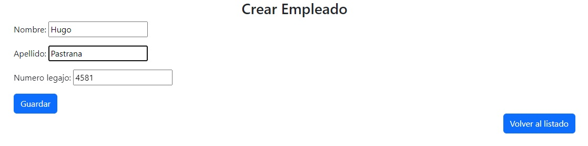

Carga Exitosa. 
Luego se realizaron 3 cargas mas con exito.

Carlos Alberto Belgrano   Legajo: 874
Juan Pablo Campos Villa   Legajo: 1174
Federico Saravia Mir   Legajo: 124

Segunda Carga

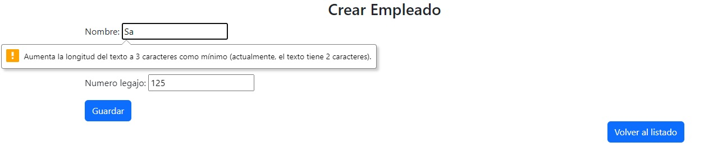
Carga Fallida. Se muestra error en Nombre.

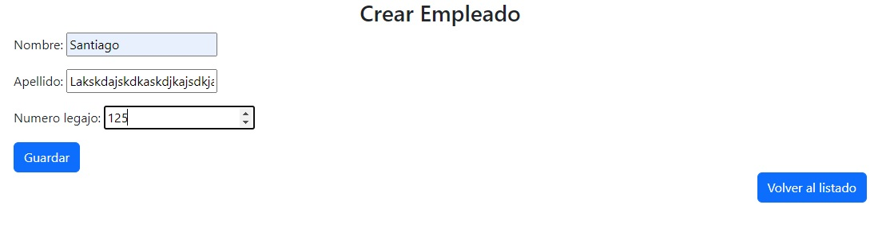
En el campo Apellido solo se permiten hasta 30 caracteres. Idem para Nombre.

 Se corrige.  
  
 Carga exitosa.

Tercer Carga

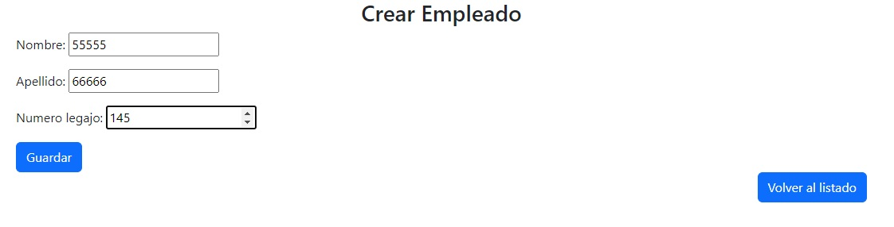
Carga Fallida. Se guardan numeros o caracteres especiales en Nombre y Apellido

 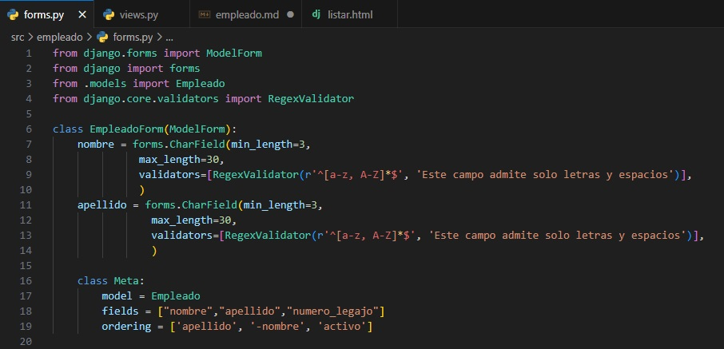  
 Se soluciona con el Validador RegexValidator!

 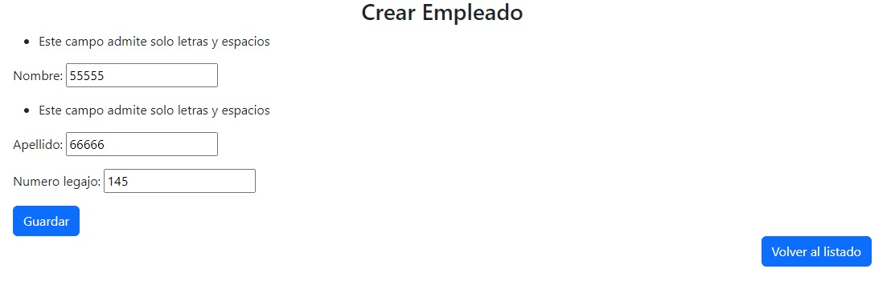

Cuarta Carga

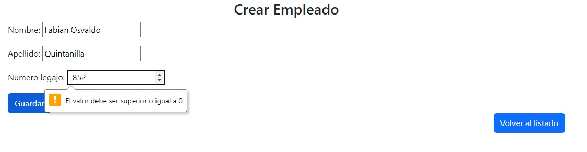
Carga Fallida. Se muestra el error en numero de legajo.

Carga exitosa cargando numeros positivos.

ACLARACION: En este campo se podria colocar un validador para acortar rango de legajo.

Quinta Carga

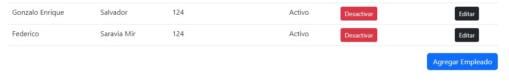
Se cargan legajos repetidos.

Se soluciona en el modelo de empleado agregando unique=True.

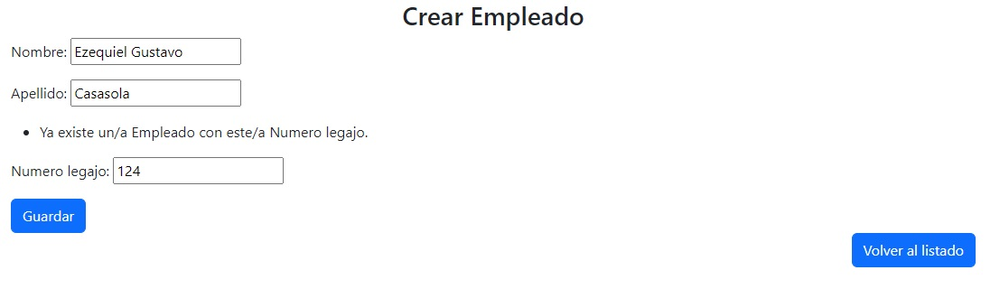

ACLARACION: Se puede cargar el legajo 0 pero se puede corregir desactivandolo.

## Funcionalidad para visualizar el listado
Utilizacion del template listar.html usando una tabla. Se vizualizan los campos:
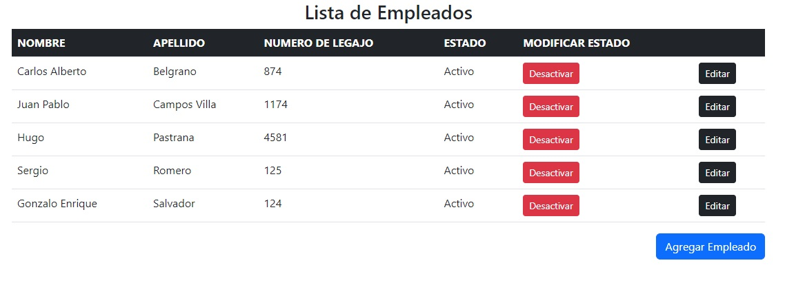
Los botones Editar, Desactivar y Agregar Empleado se encuentran presentes

MODIFICACIONES: Se modifica template para una mejor vizualizacion. La 1ra columna muestra ahora apellido.  
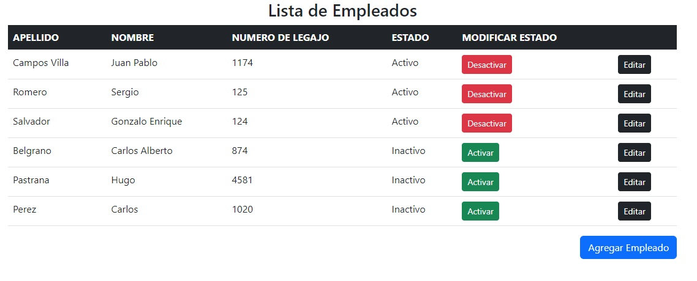

Tambien se modifica la views y ordena por apellido y el campo activo. 
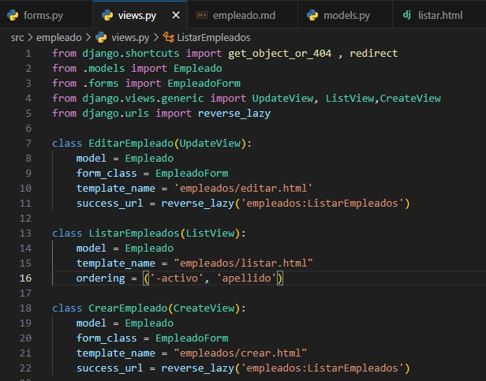

## Funcionalidad para actualizar registros
Funcion del boton editar correcta despliega los datos correctos del campo elegido.
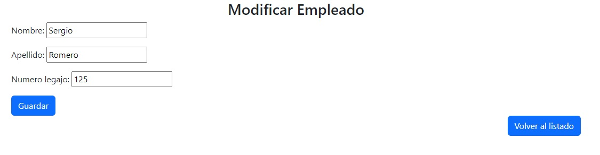

Cambio de nombre de Sergio a Sebastian
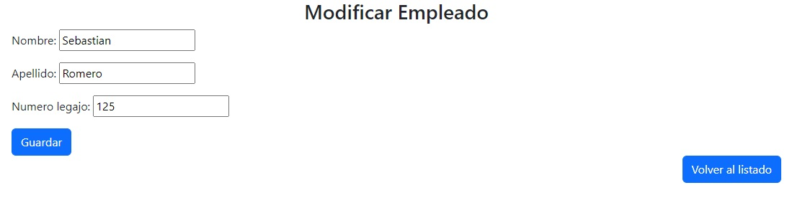
Cambios guardados exitosamente.

## Funcionalidad para desactivar registros
Listado sin desactivar.
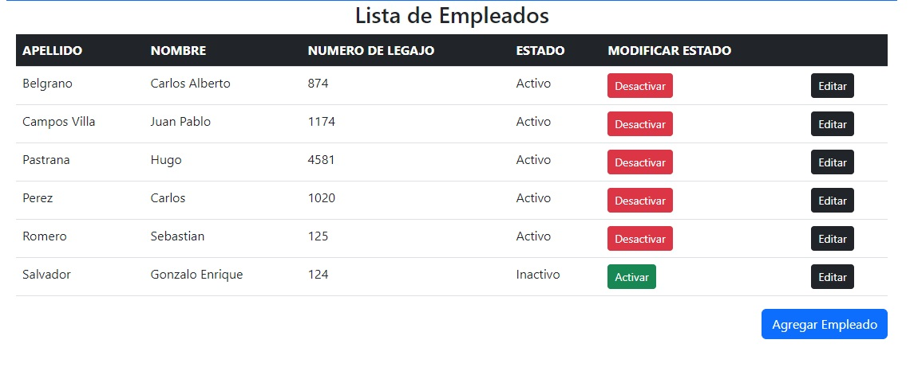

Desactivados: Romero y Belgrano.
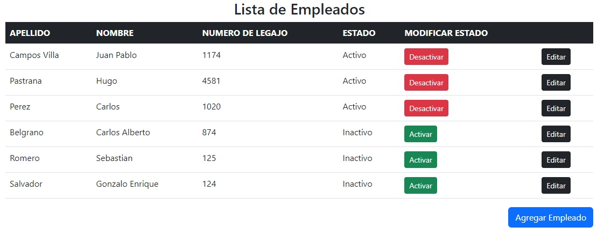
Funcionan correctamente los cambios de estado. 

## Registros en el Admin y/o en el DB Browser
**Admin**
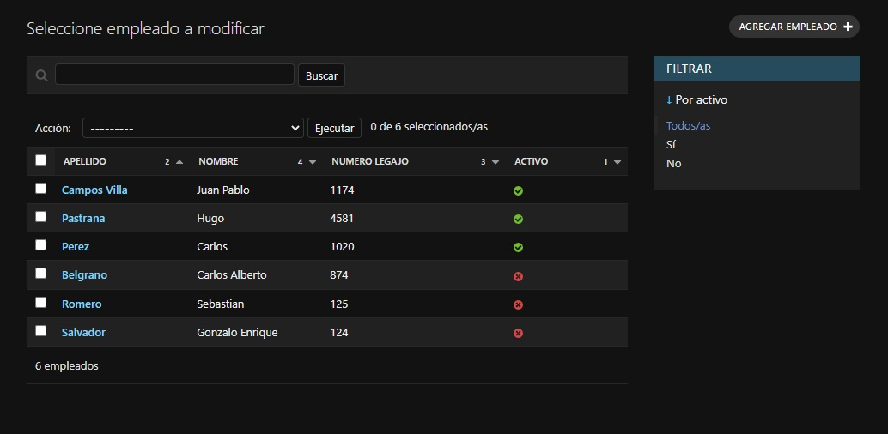
La base de datos se ve reflejada correctamente en el Admin.

**DB Browser**
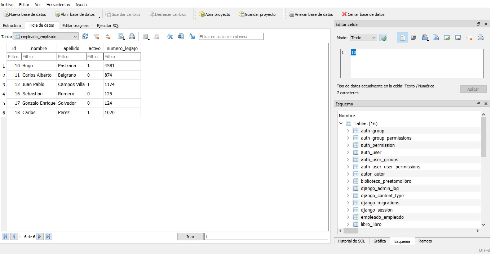
Confirmacion de base de Datos usando el Db Browser