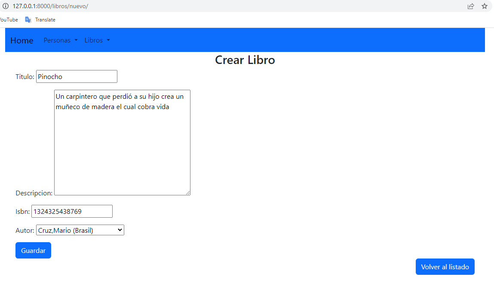
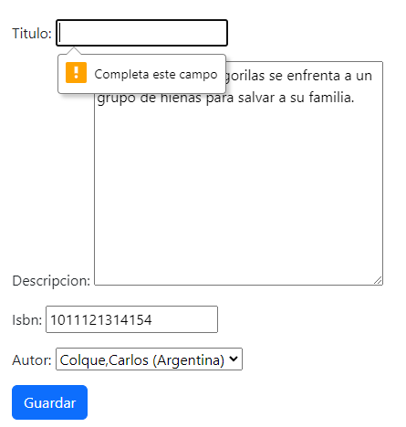
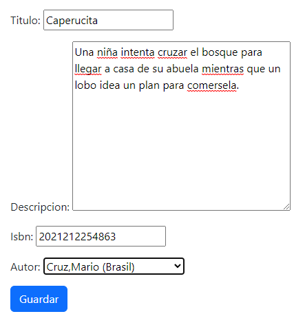
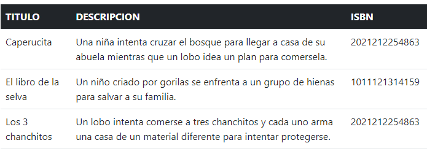
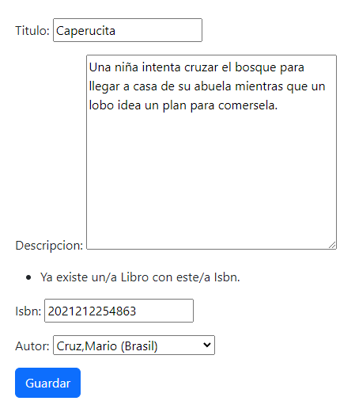
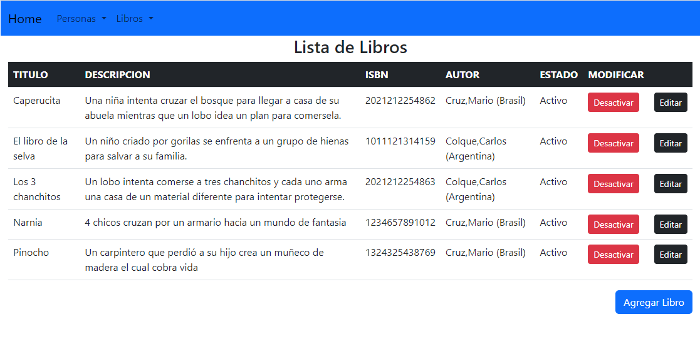
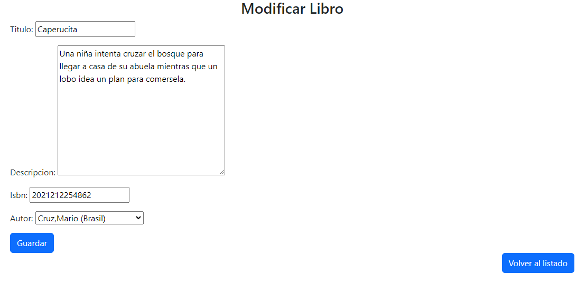
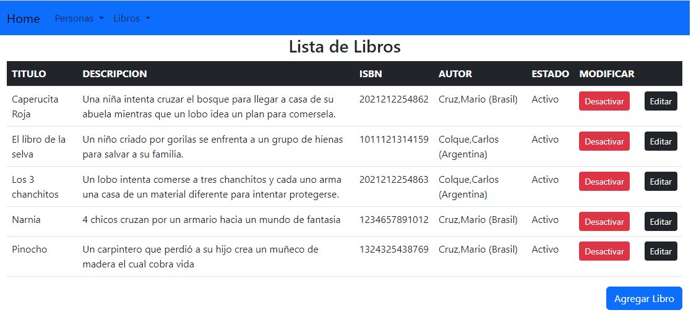
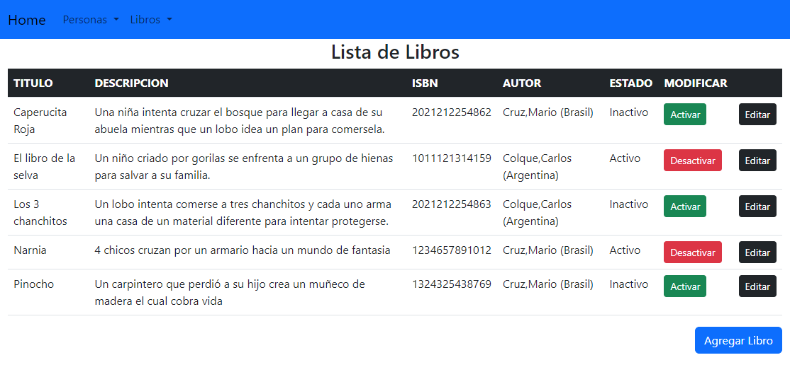
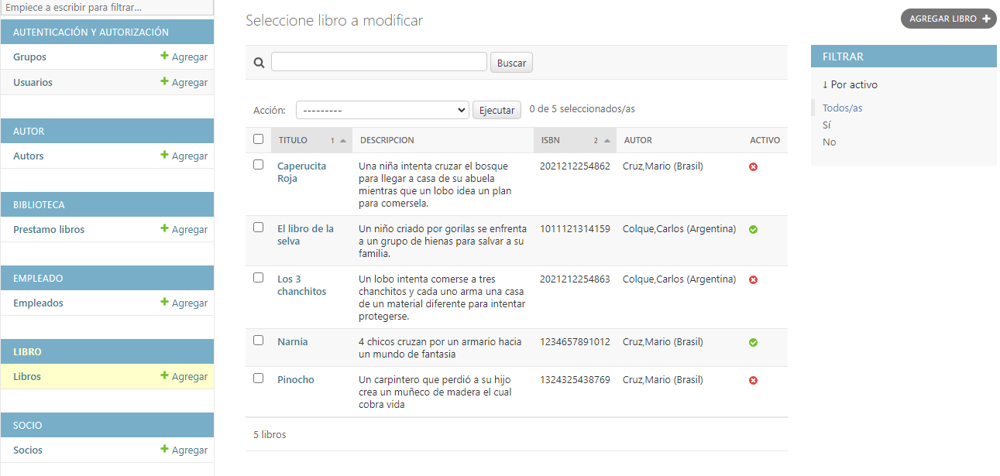

# Test Modulo Libro
Fecha 02/06/23

## Funcionalidad para agregar nuevos registros
 
Formulario de carga con Campos: titulo, descripcion, isbn y autor (estado activo por defecto)

Primera Carga

Carga Exitosa.

Segunda Carga

Carga Fallida. Se muestra error en Titulo.

Se corrige.  
  
Carga exitosa.

Tercer Carga

Carga Fallida. Se muestra mensaje, en ISBN solo se permiten 13 digitos.

Se corrige.

Carga exitosa.

Cuarta Carga

Carga Fallida. Se muestra mensaje de que debe elegirse un autor.

Se corrige.

Carga exitosa

Quinta Carga

Se cargan ISBN repetidos.

Se soluciona en el modelo de libro agregando unique=True en isbn.

Tambien se probó la carga de un ISBN negativo, lo cual probocaba la caida del servidor.
Se corrigió en el validators.py de libro agregando un mensaje de error si se ingresa
un numero negativo.

## Funcionalidad para visualizar el listado
Utilizacion del template listar.html usando una tabla. Se vizualizan los campos:

Los botones Editar, Desactivar/Activar y Agregar Libro se encuentran presentes

## Funcionalidad para actualizar registros
Funcion del boton editar correcta despliega los datos correctos del campo elegido.

Cambio de titulo de Caperucita a Caperucita Roja

Cambios guardados exitosamente.

## Funcionalidad para desactivar registros
Listado sin desactivar.

Desactivados: Caperucita Roja, Los 3 chanchitos y Pinocho.

Funcionan correctamente los cambios de estado. 

## Registros en el Admin

La base de datos se ve reflejada correctamente en el Admin.