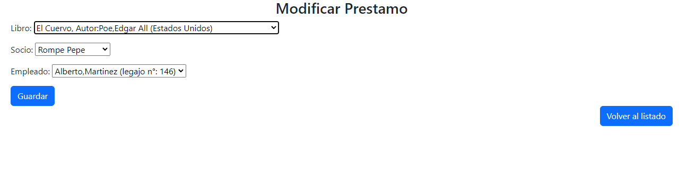
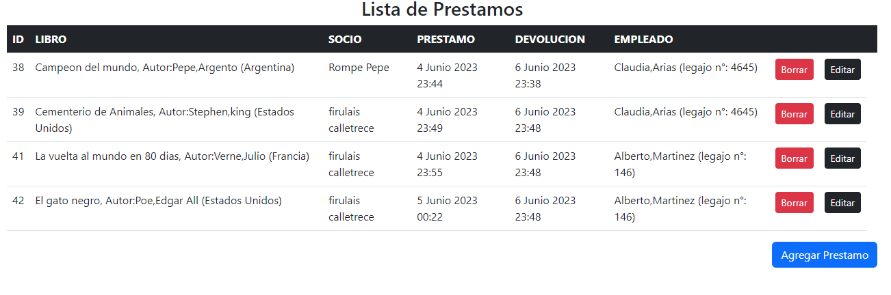

# Test Modulo Prestamo de Libros
Fecha 25/05/23
## Funcionalidad para agregar prestamo
 
Formulario de carga con Campos (Libro, Socio, Empleado):

Primera Carga

Carga Exitosa   

Segunda Carga

Segunda carga, intento realizar prestamo de un libro el cual ya estaba en prestamo...
  
 reintentando...  

   
  
 Carga exitosa: Se corrigio agregando un validar en el campo del libro, con solo cambiar a un libro disponible se puede realizar la carga exitosa

Tercer Carga

Carga exitosa: Se realizo carga con un socio que ya tenia un prestamo de otro libro

Cuarta Carga

Carga exitosa: Se cambio de socio y de empleado, carga exitosa.

## Funcionalidad para visualizar el listado de Libros prestados
Utilizacion de Template listar.html usando una tabla se vizualizan los campos:

Botones Borrar, Editar y Agregar Prestamo

## Funcionalidad para actualizar registros
Funcion del boton editar correcta despliega los datos correctos del campo elegido

cambio de nombre de Antonio a Pedro

Guardado Exitoso

## Funcionalidad Borrar registros
Para la funcion de Borrar, se agrego un campo "activo" al modelo, para no borrar el registro y quede constancia en la base de datos, por lo tanto al borrar se desactiva el prestamo.

Listado sin borrar 

Borrando el prestamo del libro "El gato negro"
    Se consulta previamente si esta seguro de la accion de borrar

Funcionalidad Exitosa se muestra el listado del prestamo actualizado 

* Como bonus se vuelve a agregar el prestamo del libro que se habia borrado:

Se muestro la carga exitosa:

## Registros en el Admin 
**Admin**
La base de datos se ve reflejada correctamente en el Admin.

