# Test Modulo Socio
Fecha 25/05/23
## Funcionalidad para agregar nuevos registros
 
Formulario de carga con Campos (nombre, apellido fecha de nacimiento):

Primera Carga

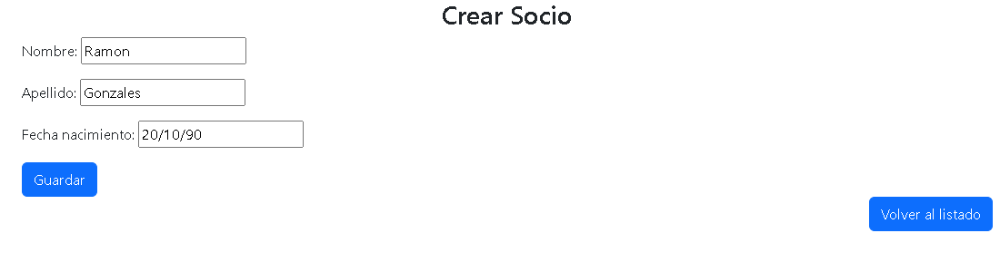

Carga Exitosa   

Segunda Carga

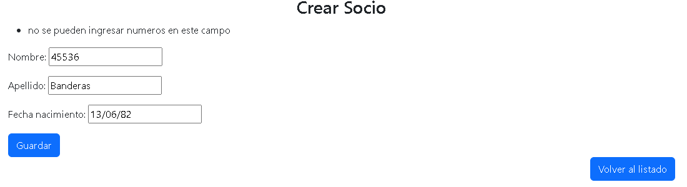

Carga Fallida se muestra el error

 reintentando...  

 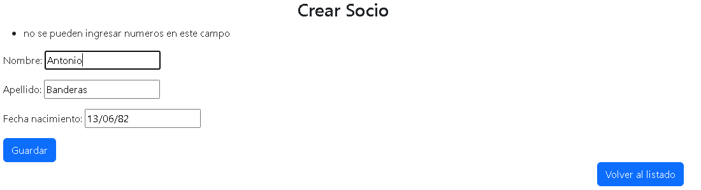  
 carga exitosa funcionalidad de Validador solo texto comprobada!

Tercer Carga

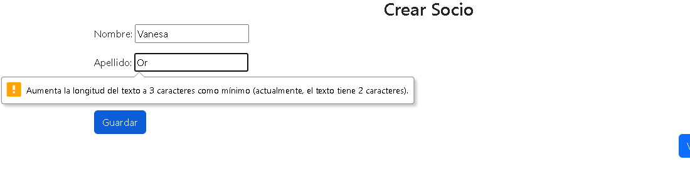

Carga Fallida se muestra el error

 reintentando...  

 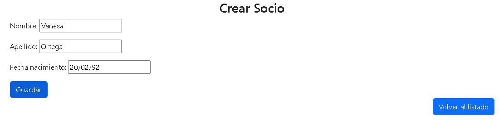  
 carga exitosa funcionalidad de Validador min length comprobada!

Cuarta Carga

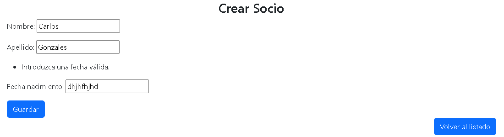

Carga Fallida se muestra el error

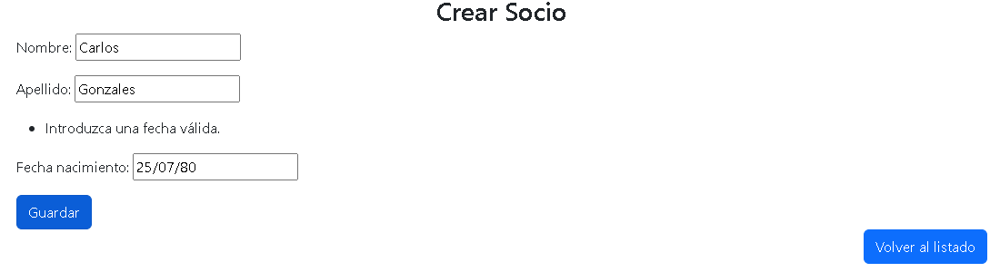

Carga exitosa probado el campo fecha   

## Funcionalidad para visualizar el listado
Utilizacion de Template listar.html usando una tabla se vizualizan los campos:
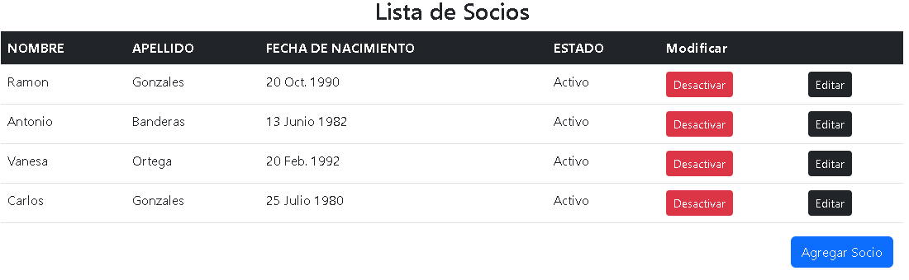
Botones Editar, Desactivar y Agregar Socio Presentes

## Funcionalidad para actualizar registros
Funcion del boton editar correcta despliega los datos correctos del campo elegido
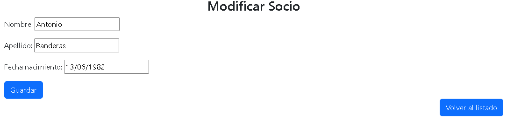
cambio de nombre de Antonio a Pedro
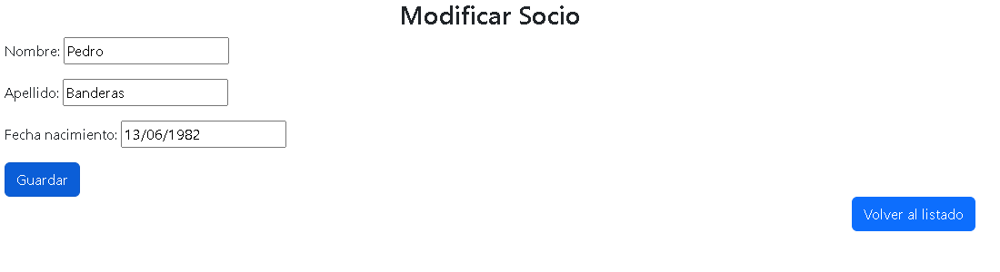
Guardado Exitoso
## Funcionalidad para desactivar registros
Listado sin desactivar
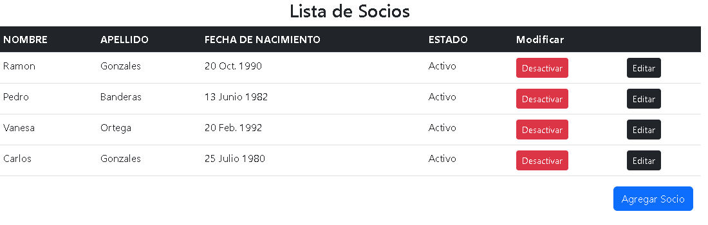
desactivando Banderas y Ortega...
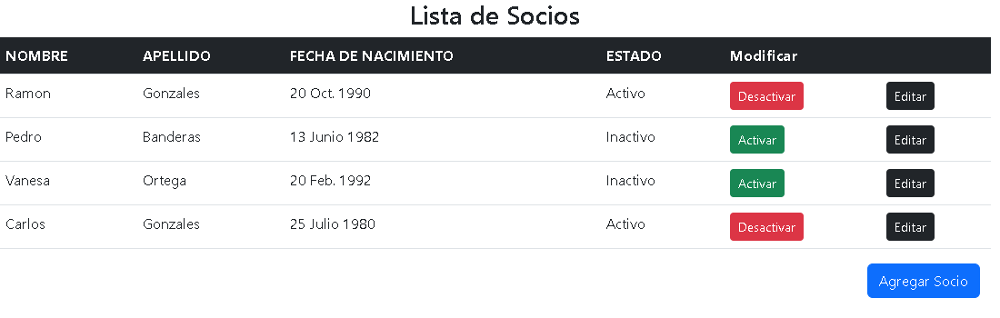
Funcionalidad Exitosa se muestra correctamente los cambios de estado 

## Registros en el Admin y/o en el DB Browser
**Admin**
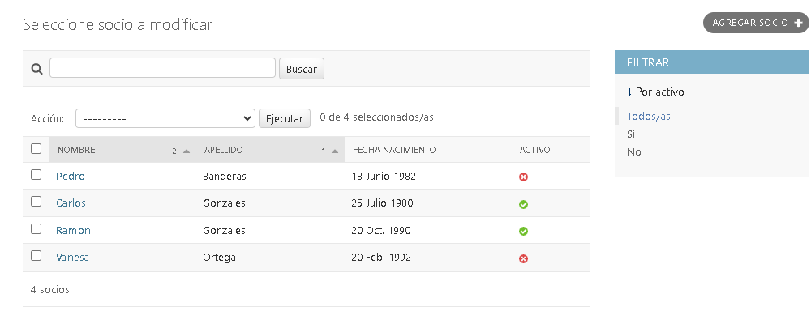
base de datos reflejada correctamente en el Admin
**DB Browser**
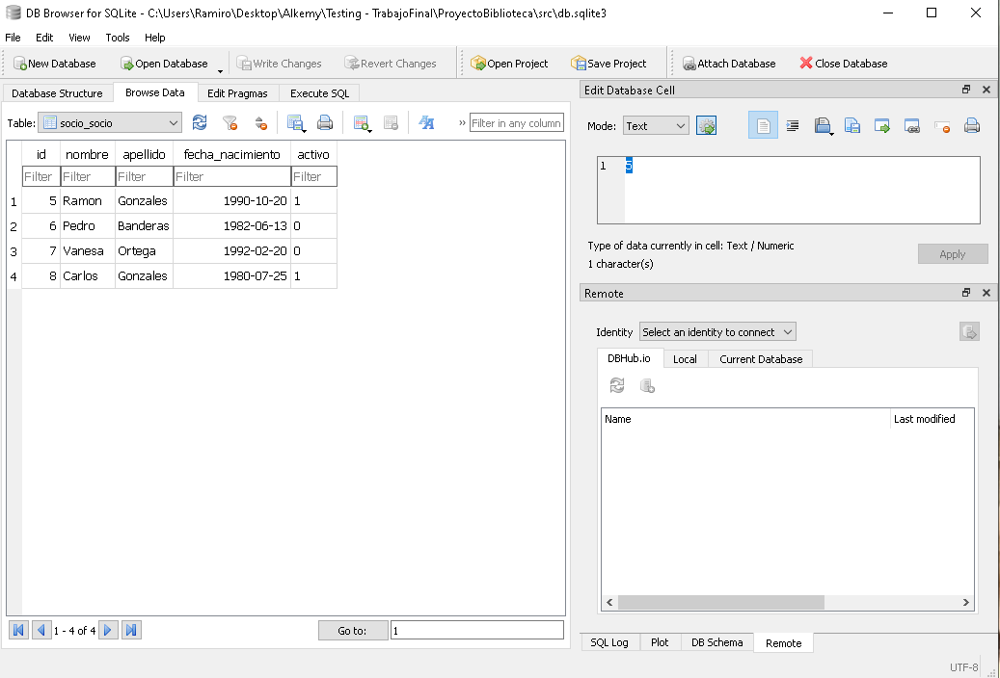
Confirmacion de base de Datos usando el Db Browser

